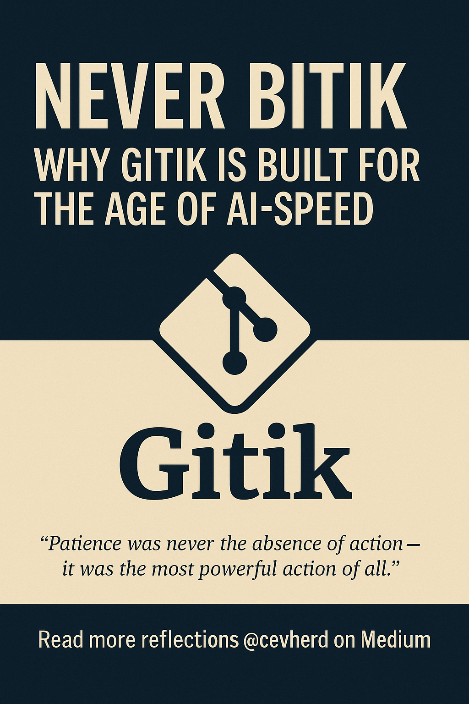

# Gitik – GitHub in One-Liners, Evolved Together



Gitik is a command assistant and knowledge engine that turns your GitHub tasks into concise, safe, and explainable one-liners. Built on curated libraries and community input, it helps beginners and pros alike navigate Git, GitHub, and DevOps workflows with confidence.

## 📖 What does *Gitik* mean?

**Gitik** *(noun, slang)*  
From “git” + Turkish suffix “-ik”, meaning something simplified or miniaturized.  
Gitik makes Git friendly, fast, and fear-free.  
**In use:** “Bunu Gitik’le çözdüm.” — "Solved it with Gitik."

## 📁 1. Gitik/ – Public Community-Facing Repo
```bash
Gitik/
├── knowledge/
│   ├── one_liner_library.yaml
│   ├── aws_only_tasks.yaml
│   └── github_actions_cases.yaml
├── docs/
│   └── style-guide.md
├── Makefile
├── README.md
└── LICENSE
```

📓 Contribution & Branching Guide → [docs/git-workflow-guideline.md](docs/git-workflow-guideline.md)

---

## 🔍 How It Works

Gitik is powered by logic engines and curated reference sets including:

- ✅ `one_liner_library.yaml` — Categorized GitHub, Git, Bash, Python commands
- ✅ `aws_only_tasks.yaml` — Git and GitHub tasks scoped to AWS workflows
- ✅ `github_actions_cases.yaml` — Use-case driven GitHub Actions examples

Each response includes:
- The safest command
- A non-jargon explanation
- Generalization/specialization tips

---

## 📚 Knowledge Sources

Gitik’s logic and examples are synthesized from:

- GitHub Docs & Developer Guides  
- AWS & GCP CLI tutorials  
- Popular GitHub Gists  
- Community-submitted one-liners  
- Technical blogs, Medium articles, and shell guides

You’ll find the structured knowledge used by Gitik in the `/knowledge` folder.

---

## 🧠 Contribute to Gitik

We welcome contributions in the form of:
- New one-liner scenarios
- Simplified command rewrites
- Workflow automation patterns
- Your Git success/fail stories

## Gitik – GitHub in One-Liners
See `docs/style-guide.md` for contribution guidelines.
All commands live inside `/knowledge`.

Run `make venv && make activate` to set up the environment.


---

## 🌊 Let's Build Gitik Together

Interested in collaborating? Sailing through oceans of opportunity starts here 🌍

Whether you're:
- Just starting with Git
- Passionate about documentation
- A CLI wizard
- Or someone who just enjoys building helpful tools...

🚀 **No experience required.**

We're growing Gitik into a knowledge vessel that blends community and utility—with the potential to evolve into:
- Formal working agreements
- Actionable profit-sharing streams
- Projects documented in **Canvas**, **Figma**, **Asana**, or deployed via **GitHub Pages**

💬 **Start by saying hello via my Medium profile:**  
👉 [https://medium.com/@cevherdogan](https://medium.com/@cevherdogan)

Looking forward to your ideas, energy, and feedback.

## 📄 License

This project is licensed under the [MIT License](LICENSE).  
For author’s notes and commentary, see [Medium – @cevherdogan](https://medium.com/@cevherdogan)

## 🖼️ Visual Identity


Gitik represents more than CLI productivity.  
It’s about clarity, calm, and contributing at your own pace—**without ever being Bitik.**

