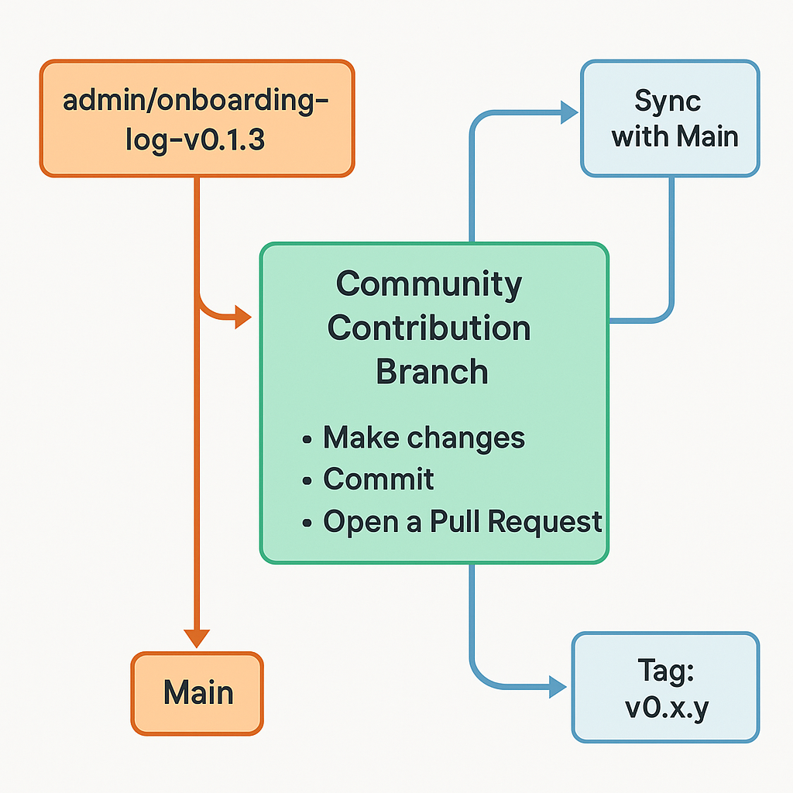

# 🧭 Gitik Workflow & Contribution Guide

Welcome to Gitik's contribution and branching guideline. This guide is a blend of **real actions** taken by the current maintainer, and a general-purpose Git model for contributors and future admins.

It includes:
- ✅ Live admin walkthrough
- 🧠 Community contribution instructions
- 🔁 Syncing strategies
- 🏷️ Tagging and release workflow
- 📚 References and community pathways

---

## 📍 A. Admin Walkthrough (v0.1.3)

The following steps reflect actual actions taken by @cevherdogan to document Gitik's branching, PR, and tagging flow.



Please resize all images as in here so there is uniformity in our documumentation - I am very happy for similar suggestions as to decorate this template as a better moving and lively repo with your active and engaged partipation


```bash
# Create a new branch from main
git checkout -b admin/onboarding-log-v0.1.3

# Add documentation
git add docs/git-workflow-guideline.md

# Commit with purpose
git commit -m "🧭 Add admin walkthrough and branching/PR guideline (v0.1.3)"

# Push the branch
git push -u origin admin/onboarding-log-v0.1.3
````

After review and merge:

```bash
# Update local main and tag release
git checkout main
git pull origin main
git tag -a v0.1.3 -m "v0.1.3 – Admin-led onboarding flow and contributor guidance"
git push origin v0.1.3
```

---

## 📍 B. General Contribution Flow

All contributors (whether collaborators or fork-based) should:

```bash
# If you haven't yet, clone the repo
git clone https://github.com/cevherdogan/Gitik.git
cd Gitik

# Create your feature branch
git checkout -b feature/<your-feature-name>

# Make changes, then stage and commit
git add .
git commit -m "feat: <what you did>"

# Push your branch
git push origin feature/<your-feature-name>
```

Then go to GitHub and:

* Open a Pull Request (PR) to `main`
* Write a clear description
* Reference related issues or discussions

---

## 🔁 Staying Synced with Main (If Remote Was Updated)

If someone else merges to `main`, do this to stay up to date:

```bash
git checkout main
git pull origin main

# Update your feature branch
git checkout feature/<your-feature>
git merge main  # or git rebase main
```

---

## 🏷️ C. Tagging and Releasing

After a PR is merged, admins may create a tagged release:

```bash
git checkout main
git pull origin main
git tag -a v0.X.Y -m "Brief, useful description of the release"
git push origin v0.X.Y
```

Tags are used to:

* Signal stable checkpoints
* Generate changelogs and release notes
* Support GitHub’s versioned release system

---

## 👥 D. Maintainer Notes & Participation Invitation

Gitik is managed by [@cevherdogan](https://github.com/cevherdogan), who is looking for:

* Future admins
* DevOps-minded contributors
* Writers, documenters, and CLI testers
* People who like **to build, cleanly**

Whether you're a beginner or seasoned open-source veteran, **your input matters**. Several participation paths include:

* Formal collaboration:
  [Personal Call for Participation](https://medium.com/personal-call-for-participation-in-github-projects)

* Incremental, test-driven DevSecOps practice:
  [Dev Guidelines and GitHub Actions](https://medium.com/guncelproblemler)

* Experimental, fun projects:
  [Fusion Projects & Future Tech](https://medium.com/experimental-fusions)

* Commercial potential initiatives:
  [AdTech and Product Monetization](https://medium.com/mcmc-targeted-advertisements)

---

## 📚 E. Open Source References

* Raymond, E. S. (1999). *The Cathedral and the Bazaar*. O’Reilly.
* Fogel, K. (2005). *Producing Open Source Software*. O’Reilly.
* Dabbish, L., Stuart, C., Tsay, J., & Herbsleb, J. (2012). *Social coding in GitHub: Transparency and collaboration in an open software repository*. CSCW.
* Eghbal, N. (2016). *Roads and Bridges: The Unseen Labor Behind Our Digital Infrastructure*. Ford Foundation.
* GitHub Docs: [https://docs.github.com/en](https://docs.github.com/en)

---

## What am I doing now?
1. Save this as `docs/git-workflow-guideline.md`
2. Then, run:

```bash
git add docs/git-workflow-guideline.md
git commit --amend --no-edit
git push --force
````

---

## 🔗 Add to README.md After Merge

```markdown
📓 Contribution & Branching Guide → [docs/git-workflow-guideline.md](docs/git-workflow-guideline.md)
```

---

## ✅ Final Notes

This file is considered the **canonical guide for contributions, branching, and collaboration** within Gitik.

Future Gitik-inspired or Gitik-extended repositories may adopt this format and adjust it based on scale, participation level, and security/commercial needs.

If you’re reading this from a fresh clone or via a GitHub link—welcome. You’re invited to participate, learn, build, or simply follow along.

> Gitik grows with each safe commit, each explained one-liner, and each moment of intentional contribution.  
> Thank you for being here.

🧭 Maintained by: [@cevherdogan](https://github.com/cevherdogan)  
🔗 Project home: [https://github.com/cevherdogan/Gitik](https://github.com/cevherdogan/Gitik)


